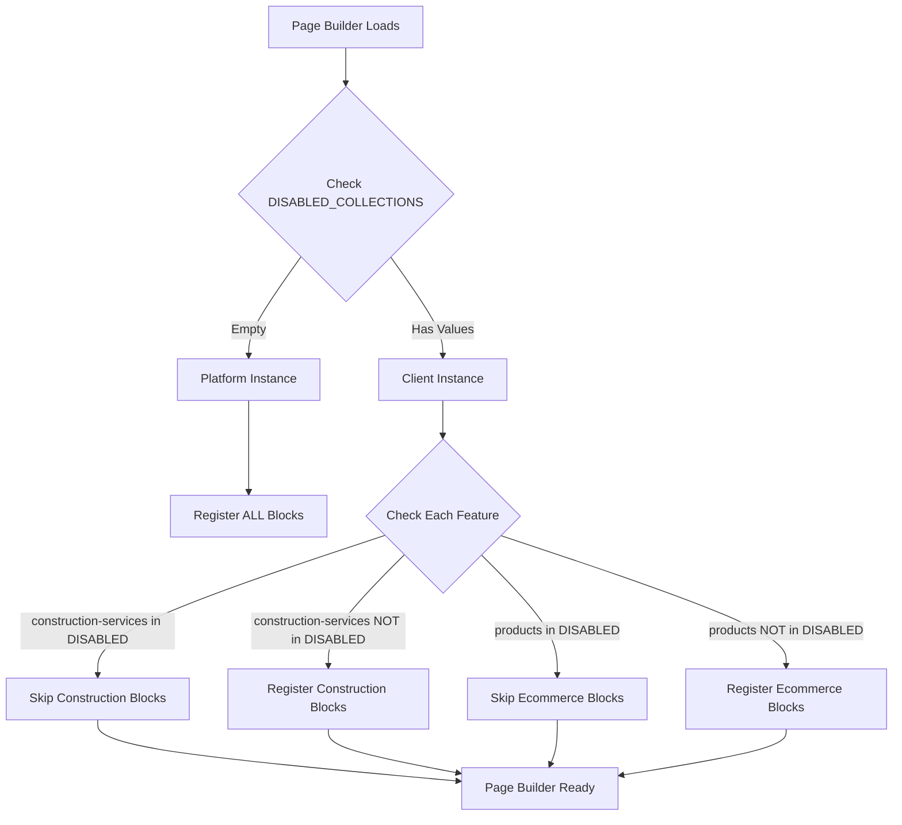

# Blocks & Feature Flags - Complete Guide

**Date:** 2026-02-21
**Author:** Claude Code
**Status:** Implementation Guide

---

## 📋 Overzicht

Dit document legt uit hoe **Payload blocks** werken met **feature flags**, zodat blocks alleen beschikbaar zijn wanneer de bijbehorende feature actief is voor een klant.

---

## 🎯 Probleem & Oplossing

### Probleem

Als een klant de "Construction" feature NIET heeft:
- ❌ `construction-services` collection is DISABLED
- ❌ Maar `ConstructionHero` block is nog steeds ZICHTBAAR in page builder
- ❌ Klant kan block toevoegen maar data komt niet uit de database
- ❌ Verwarrend en bugs!

### Oplossing

Blocks moeten **conditioneel geregistreerd** worden:
- ✅ Als `construction-services` DISABLED → `ConstructionHero` block NIET registreren
- ✅ Als `construction-services` ENABLED → `ConstructionHero` block WEL registreren
- ✅ Klant ziet alleen blocks van ACTIEVE features

---

## 🔧 Implementatie

### Stap 1: Feature Detection Utility

Gebruik de `isFeatureEnabled()` utility:

```typescript
// src/lib/features/isFeatureEnabled.ts

import { isConstructionEnabled } from '@/lib/features/isFeatureEnabled'

// Check of construction feature actief is
if (isConstructionEnabled()) {
  // Feature is enabled - register blocks
}
```

**Available Helpers:**
```typescript
isFeatureEnabled('construction-services')  // Check specific collection
isConstructionEnabled()                    // Check construction branch
isEcommerceEnabled()                       // Check ecommerce branch
isContentEnabled()                         // Check content branch
isMarketplaceEnabled()                     // Check marketplace branch
isPlatformInstance()                       // Check if platform (all features)
```

### Stap 2: Create Branch Blocks

Elke branch heeft zijn eigen blocks:

```
src/branches/construction/blocks/
├── ConstructionHero.ts      # Hero for construction sites
├── ServicesGrid.ts          # Grid of services
├── ProjectsGrid.ts          # Grid of projects
├── ReviewsGrid.ts           # Grid of reviews
└── index.ts                 # Export all blocks
```

**Example Block:**
```typescript
// src/branches/construction/blocks/ConstructionHero.ts
import type { Block } from 'payload'

export const ConstructionHero: Block = {
  slug: 'construction-hero',
  labels: {
    singular: 'Bouw Hero',
    plural: 'Bouw Hero Secties',
  },
  fields: [
    // ... fields
  ],
}
```

### Stap 3: Export Blocks from Branch

```typescript
// src/branches/construction/blocks/index.ts

export { ConstructionHero } from './ConstructionHero'
export { ServicesGrid } from './ServicesGrid'
export { ProjectsGrid } from './ProjectsGrid'
export { ReviewsGrid } from './ReviewsGrid'

// Export all as array for easy registration
export const constructionBlocks = [
  ConstructionHero,
  ServicesGrid,
  ProjectsGrid,
  ReviewsGrid,
]
```

### Stap 4: Conditional Registration in Pages Collection

**Before (WRONG ❌):**
```typescript
// src/collections/Pages/index.ts

import { ConstructionHero } from '@/branches/construction/blocks'

export const Pages: CollectionConfig = {
  // ...
  fields: [
    {
      name: 'layout',
      type: 'blocks',
      blocks: [
        // Shared blocks
        HeroBlock,
        ContentBlock,

        // Construction blocks - ALWAYS visible (BAD!)
        ConstructionHero,  // ❌ Visible for all clients!
      ]
    }
  ]
}
```

**After (CORRECT ✅):**
```typescript
// src/collections/Pages/index.ts

import { isConstructionEnabled } from '@/lib/features/isFeatureEnabled'
import { constructionBlocks } from '@/branches/construction/blocks'

export const Pages: CollectionConfig = {
  // ...
  fields: [
    {
      name: 'layout',
      type: 'blocks',
      blocks: [
        // ═════════════════════════════════════════════════════════
        // SHARED BLOCKS - Always available
        // ═════════════════════════════════════════════════════════
        HeroBlock,
        ContentBlock,
        FormBlock,

        // ═════════════════════════════════════════════════════════
        // CONSTRUCTION BLOCKS - Only if feature enabled
        // ═════════════════════════════════════════════════════════
        ...(isConstructionEnabled() ? constructionBlocks : []),

        // ═════════════════════════════════════════════════════════
        // ECOMMERCE BLOCKS - Only if feature enabled
        // ═════════════════════════════════════════════════════════
        ...(isEcommerceEnabled() ? ecommerceBlocks : []),

        // ═════════════════════════════════════════════════════════
        // CONTENT BLOCKS - Only if feature enabled
        // ═════════════════════════════════════════════════════════
        ...(isContentEnabled() ? contentBlocks : []),

      ].filter(Boolean),  // Remove any null/undefined
    }
  ]
}
```

---

## 🌍 Environment Variables

### Platform Instance (All Features)

```bash
# .env (platform instance - cms.compassdigital.nl)
DISABLED_COLLECTIONS=
# Empty = all features enabled
```

**Result:**
- ✅ All collections visible
- ✅ All blocks available
- ✅ Admin sees everything

### Client Instance (Selective Features)

```bash
# .env (client instance - client1.example.com)
DISABLED_COLLECTIONS=construction-services,construction-projects,construction-reviews,quote-requests,vendors,workshops
```

**Result:**
- ❌ Construction collections HIDDEN
- ❌ Construction blocks NOT available
- ❌ Marketplace collections HIDDEN
- ❌ Marketplace blocks NOT available
- ✅ Ecommerce collections visible
- ✅ Ecommerce blocks available

---

## 📊 Feature Detection Flow



---

## 🎨 Block Categories in Admin

Blocks worden automatisch gegroepeerd per feature:

```
Page Builder - Add Block
├─ 📦 Shared
│  ├─ Hero
│  ├─ Content
│  └─ Form
├─ 🏗️ Construction (only if enabled)
│  ├─ Construction Hero
│  ├─ Services Grid
│  ├─ Projects Grid
│  └─ Reviews Grid
├─ 🛒 E-commerce (only if enabled)
│  ├─ Product Grid
│  ├─ Cart Summary
│  └─ Checkout Form
└─ 📝 Content (only if enabled)
   ├─ Blog Posts Grid
   ├─ FAQ Accordion
   └─ Testimonials
```

---

## 🧪 Testing

### Test 1: Platform Instance (All Features)

```bash
# .env
DISABLED_COLLECTIONS=

# Expected:
# - Admin panel shows ALL collections
# - Page builder shows ALL blocks
# - Construction blocks visible ✅
# - Ecommerce blocks visible ✅
# - Content blocks visible ✅
```

### Test 2: Construction-Only Client

```bash
# .env
DISABLED_COLLECTIONS=products,orders,blog-posts,vendors

# Expected:
# - Admin panel shows ONLY construction collections ✅
# - Page builder shows ONLY construction blocks ✅
# - Ecommerce blocks HIDDEN ✅
# - Content blocks HIDDEN ✅
```

### Test 3: Ecommerce-Only Client

```bash
# .env
DISABLED_COLLECTIONS=construction-services,construction-projects,blog-posts

# Expected:
# - Admin panel shows ONLY ecommerce collections ✅
# - Page builder shows ONLY ecommerce blocks ✅
# - Construction blocks HIDDEN ✅
# - Content blocks HIDDEN ✅
```

---

## 🚀 Best Practices

### 1. Group Blocks by Branch

```typescript
// ✅ GOOD - Blocks organized by branch
src/branches/construction/blocks/
src/branches/ecommerce/blocks/
src/branches/content/blocks/

// ❌ BAD - Mixed blocks
src/blocks/ConstructionHero.ts
src/blocks/ProductGrid.ts
src/blocks/BlogPosts.ts
```

### 2. Export Block Arrays

```typescript
// ✅ GOOD - Easy to conditionally register
export const constructionBlocks = [Hero, Services, Projects]

// Usage:
...(isConstructionEnabled() ? constructionBlocks : [])

// ❌ BAD - Hard to conditionally register
export { Hero, Services, Projects }

// Would need:
...(isConstructionEnabled() ? [Hero, Services, Projects] : [])
```

### 3. Use Feature Helpers

```typescript
// ✅ GOOD - Clear intent
if (isConstructionEnabled()) {
  // Construction feature active
}

// ❌ BAD - Hard to understand
if (!_disabledSet.has('construction-services') ||
    !_disabledSet.has('construction-projects')) {
  // What does this check?
}
```

### 4. Document Block Purpose

```typescript
/**
 * Construction Hero Block
 *
 * Hero section specifically for construction/bouwbedrijf websites.
 * Only available when Construction feature is enabled.
 *
 * Based on: VanderBouw template
 * Feature: Construction
 * Collections: construction-services, construction-projects
 */
export const ConstructionHero: Block = {
  // ...
}
```

---

## 📚 Real-World Example

### Scenario: New Client Onboarding

**Client:** "PlastiMed" - Needs construction + ecommerce (no marketplace)

**Step 1: Configure Features**
```bash
# client-plastimed.env
DISABLED_COLLECTIONS=vendors,vendor-reviews,workshops,blog-posts,blog-categories

# Enabled:
# ✅ construction-services, construction-projects, construction-reviews
# ✅ products, orders, product-categories
# ✅ shared (media, pages, users)

# Disabled:
# ❌ vendors, workshops (marketplace)
# ❌ blog-posts (content)
```

**Step 2: Auto-Configuration**

Feature detection automatically configures:
- ✅ Admin shows: Construction + Ecommerce collections
- ✅ Page builder shows: Construction + Ecommerce blocks
- ✅ API exposes: Construction + Ecommerce endpoints
- ❌ Admin hides: Marketplace + Blog collections
- ❌ Page builder hides: Marketplace + Blog blocks

**Step 3: Client Experience**

Client sees clean, focused interface:
```
Admin Panel
├─ 🏗️ Construction
│  ├─ Diensten
│  ├─ Projecten
│  └─ Reviews
├─ 🛒 E-commerce
│  ├─ Products
│  ├─ Orders
│  └─ Categories
└─ 📦 Shared
   ├─ Pages
   ├─ Media
   └─ Users

Page Builder
├─ 📦 Shared Blocks
├─ 🏗️ Construction Blocks
└─ 🛒 E-commerce Blocks
```

---

## 🔍 Debugging

### Check if Feature is Enabled

```typescript
import { isConstructionEnabled, getEnabledBranches } from '@/lib/features/isFeatureEnabled'

// Debug output
console.log('Construction enabled?', isConstructionEnabled())
console.log('Enabled branches:', getEnabledBranches())
console.log('Disabled collections:', getDisabledCollections())
```

### Check Block Registration

```typescript
// In Pages collection
console.log('Registered blocks:', blocks.map(b => b.slug))

// Expected output (construction enabled):
// ['hero', 'content', 'construction-hero', 'services-grid', 'projects-grid']

// Expected output (construction disabled):
// ['hero', 'content']
```

---

## 💡 Summary

**Key Takeaways:**

1. **Feature Detection** - Use `isFeatureEnabled()` helpers
2. **Conditional Registration** - Spread blocks only if feature enabled
3. **Branch Organization** - Keep blocks in `src/branches/{branch}/blocks/`
4. **Environment Control** - Use `DISABLED_COLLECTIONS` env var
5. **Clean UI** - Clients only see relevant blocks

**Result:**
- ✅ Clean, focused admin interface per client
- ✅ No confusion with irrelevant features
- ✅ Automatic feature management
- ✅ Easy to enable/disable features
- ✅ Consistent across collections, blocks, and API

---

Generated with Claude Code
